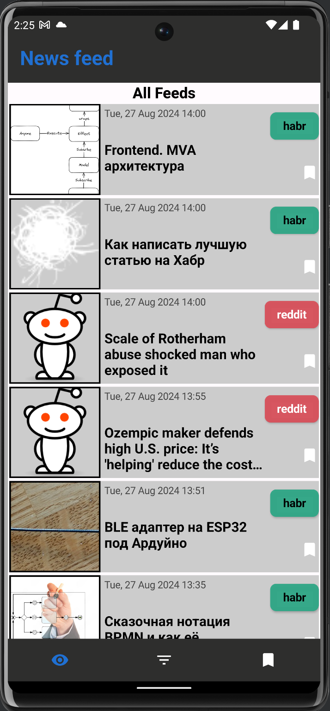
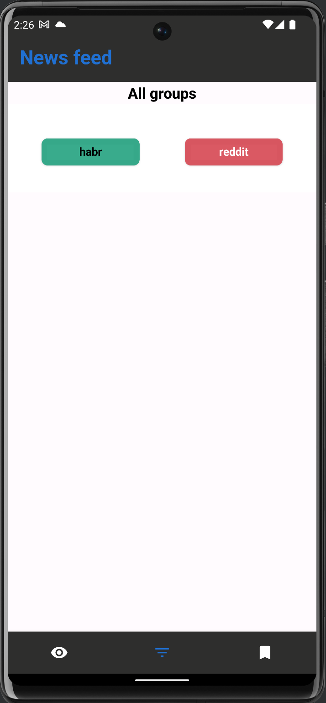
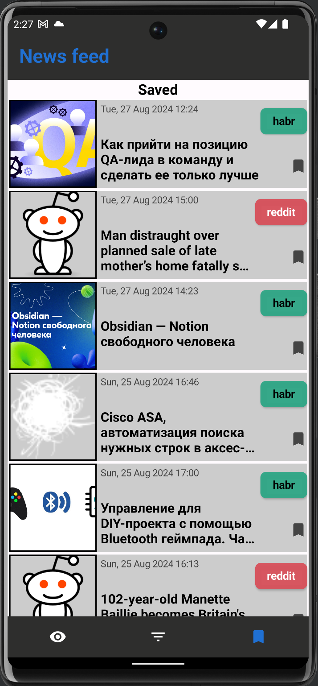
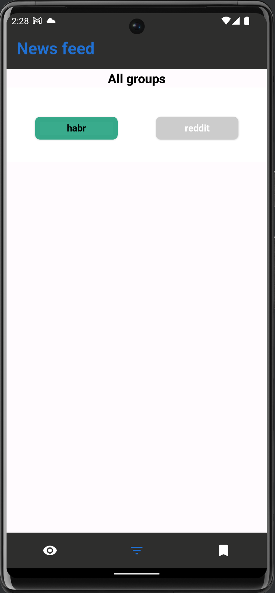
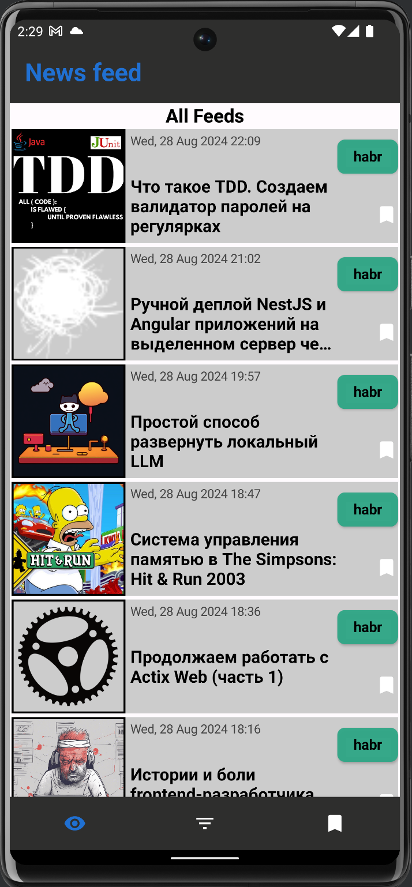
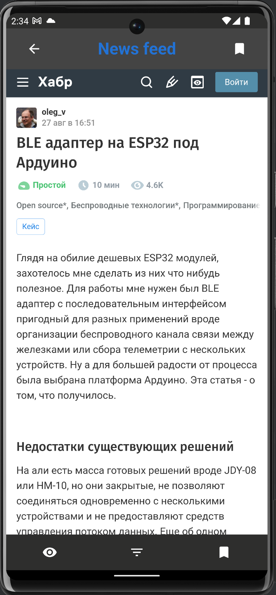

# News Feed

#### News Feed is an Android application where you can browse ***IT news*** from Sources: https://habr.com and https://www.reddit.com. You can save the news and view it on the Bookmark screen if, for example, no internet connection. Also you can open news item to display the full information in WebView.
## Screenshots

|   |  |
|:-----------------------------------:|:----------------------------------:|
|   |  |
|   |  |
